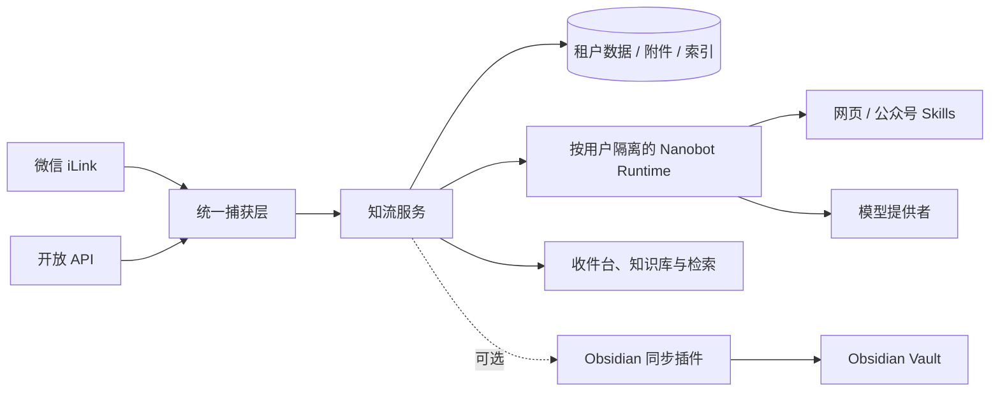

# 知流 · Knowledge Relay

[](https://github.com/qianshulab/knowledge-relay/actions/workflows/ci.yml)
[](https://github.com/qianshulab/knowledge-relay/releases/latest)
[](https://github.com/qianshulab/knowledge-relay/pkgs/container/knowledge-relay)
[](./LICENSE)

把分散的链接、文章和附件，沉淀为可以检索、理解和持续使用的知识资源。

知流是一个开源、可自托管的个人知识收件系统。它接住平时发给微信文件助手、收藏在浏览器或由开放 API 提交的文字、链接和附件，通过官方 Nanobot Runtime 完成网页解析、分类与知识化整理，让这些内容以后仍能准确找到和完整阅读。Obsidian 是重要但可选的输出连接。

系统支持管理员邀请成员使用。每个用户拥有独立的数据、微信连接、API 令牌、搜索索引、Obsidian 连接，以及按需启动的 Nanobot Runtime 工作区。Docker 默认允许宿主机网络访问，源码部署默认仅监听本机地址。

## 核心能力

- **多源内容捕获**：通过微信 iLink 或用户级 API 接收文字、链接和附件，后续接入通道复用同一流水线。
- **智能整理**：提取标题、摘要、分类、标签、专业领域、知识点和相关工具。
- **可靠网页解析**：由 Nanobot 调用固定版本的原版 Skills；瞬时错误自动重试，失败任务可以手动重新整理，原文始终保留。
- **收件台与知识库**：新内容在收件台持续处理，完成后按主题和内容形态汇入知识库；支持归档、永久删除、附件预览、深链接和稳定分页，不依赖 Obsidian 也能完整使用。
- **完整文章阅读**：公众号与网页图片会安全缓存为用户附件，正文刷新后仍可阅读，并随 Markdown 一起同步到 Obsidian。
- **知识化浏览**：通过 AI 动态主题与稳定内容形态聚合历史内容；智能图解只在用户查看时生成，按内容版本保存复用，支持缩放、拖拽、触控及 Mermaid、Obsidian Canvas 和 SVG 导出。
- **收件检索**：AI 先理解自然语言需求并生成受限计划，再由本地索引匹配真实收件内容。
- **Obsidian 增量同步**：支持批次确认、断点重试、永久 ID 去重、修订更新和附件 SHA-256 校验。
- **可靠降级**：模型未配置或暂时不可用时仍保存原文并继续同步，不阻塞收件流程。
- **多用户隔离**：服务端强制租户作用域；每个活跃用户使用独立 Nanobot 进程、Workspace、会话和 artifacts。

## 系统架构



| 组件 | 职责 |
|---|---|
| Knowledge Relay | 用户与权限、统一捕获、持久化、资源状态、索引、管理后台与输出协议 |
| Nanobot Runtime | 每个活跃用户独立运行 Agent Loop、工具与 Skills；模型配置由管理员维护 |
| Obsidian 插件 | 可选地拉取用户自己的增量批次、校验附件、写入 Vault 并确认游标 |

Nanobot 是模型与工具的统一执行边界。收件检索仅查询本地索引，不开放通用对话和数据写入能力。

## 快速开始

### Docker 部署（推荐）

要求：Git、Docker Engine 和 Docker Compose v2。

```bash
git clone https://github.com/qianshulab/knowledge-relay.git
cd knowledge-relay
./scripts/deploy-docker.sh
```

部署脚本会初始化本地配置、生成 Runtime 内部鉴权密钥并启动两个容器。Docker 默认发布到宿主机的所有网络接口：

- 本机：<http://127.0.0.1:8787>
- 局域网设备：`http://<主机IP>:8787`

检查运行状态：

```bash
docker compose ps
curl --fail http://127.0.0.1:8787/health
```

镜像发布于 GitHub Container Registry：

- `ghcr.io/qianshulab/knowledge-relay:latest`
- `ghcr.io/qianshulab/knowledge-relay-nanobot:latest`

镜像支持 `linux/amd64` 和 `linux/arm64`，不包含模型凭据。模型认证信息由部署者在本地配置。

### 网络绑定

Docker 的绑定地址由 `.env` 中的 `KNOWLEDGE_RELAY_BIND_ADDRESS` 控制。

```dotenv
# 允许同一局域网访问（默认）
KNOWLEDGE_RELAY_BIND_ADDRESS=0.0.0.0
PORT=8787

# 或绑定宿主机的固定地址
KNOWLEDGE_RELAY_BIND_ADDRESS=192.168.1.20

# 或限制为本机访问
KNOWLEDGE_RELAY_BIND_ADDRESS=127.0.0.1
```

也可以在首次部署时临时指定：

```bash
KNOWLEDGE_RELAY_BIND_ADDRESS=192.168.1.20 PORT=8787 ./scripts/deploy-docker.sh
```

局域网 HTTP 可用于管理页面。Obsidian 插件连接非本机地址时要求 HTTPS；配置反向代理与证书后，将域名转发到 `127.0.0.1:8787`，并设置：

```dotenv
PUBLIC_BASE_URL=https://inbox.example.com
```

本地构建镜像：

```bash
KNOWLEDGE_RELAY_LOCAL_BUILD=1 ./scripts/deploy-docker.sh
```

### 源码部署

要求：Node.js 22.13+、npm、Python 3.11+，适用于 macOS 和 Linux。

```bash
git clone --recurse-submodules https://github.com/qianshulab/knowledge-relay.git
cd knowledge-relay
./scripts/deploy-source.sh
```

开发模式：

```bash
npm ci
npm run setup:nanobot
npm run dev
```

## 首次配置

1. 打开管理页面并创建本地管理员账户。
2. 在“系统设置 → AI 智能整理”选择模型提供者、模型和认证方式。
3. 在“系统设置 → 微信接入”扫码连接自己的 iLink Bot。
4. 在“系统设置 → Nanobot Skills”确认网页和公众号 Skills 已启用。
5. 给机器人发送一条测试消息，在收件台确认原文、整理状态和附件。
6. 如需从其他应用提交内容，在“系统设置 → API 收件”创建令牌。
7. 如需多人使用，由管理员在“用户与工作区”生成一次性邀请链接。
8. 如需写入 Obsidian，再打开“系统设置 → Obsidian 同步”下载插件并创建连接。

模型配置和 Obsidian 都是可选项。未配置模型时仍会保存原始内容；未连接 Obsidian 时，收件台、知识库、附件预览、筛选和本地检索保持可用。

## Nanobot 与 Skills

知流使用官方 Nanobot 作为 Agent Runtime。模型提供者、模型与认证信息均在后台配置；支持模型目录 API 的提供者可以直接读取在线模型列表。

Runtime 内置五个固定版本的原版 Skills：

- [`wechat-article-extractor`](https://github.com/freestylefly/wechat-article-extractor-skill)：微信公众号文章提取。
- [`fetch-skill`](https://github.com/aresbit/fetch-skill)：普通网页读取与 Markdown 转换。
- [`mermaid-visualizer`](https://github.com/axtonliu/axton-obsidian-visual-skills/tree/main/mermaid-visualizer)：按内容关系生成流程图、思维导图、时序图、状态图与对比图。
- [`obsidian-canvas-creator`](https://github.com/axtonliu/axton-obsidian-visual-skills/tree/main/obsidian-canvas-creator)：生成可继续编辑的 Obsidian Canvas。
- [`excalidraw-diagram`](https://github.com/axtonliu/axton-obsidian-visual-skills/tree/main/excalidraw-diagram)：按明确需求生成 Obsidian 或标准 Excalidraw 图表。

依赖和运行环境已包含在 Nanobot 镜像中。Skill 的版本、许可证和外部网络行为记录在 [THIRD_PARTY.md](./THIRD_PARTY.md)。

网页解析 Skills 会在匹配的链接任务中执行。站内智能图解不会随每条收件自动生成：用户首次打开图解时，Nanobot 才根据资料关系选择流程图、关系图、对比图、时间线或思维导图等结构；结果与当前内容版本一起保存，之后直接复用。重新整理内容会使旧图解失效，只有用户明确点击“重新生成”才会再次调用模型。Mermaid、Canvas 与 SVG 均由已保存的结构确定性导出。

Nanobot 生成的 `.canvas`、`.excalidraw` 与 Mermaid Markdown 会先经过格式、规模和引用校验，再作为派生附件进入资源详情和 Obsidian 同步。`.canvas` 可由 Obsidian 原生编辑；`.excalidraw` 需要在 Obsidian 中安装 Excalidraw 插件。

公众号和普通网页任务会校验是否生成了有效 Markdown 产物。网络波动、上游限流、临时 5xx、超时或空产物会触发有限重试；最终失败时保留原文，详情页可再次提交整理。任务是否仍有进展由 Runtime 会话变化判断，不使用短时间的一刀切截止。

## 多用户与 API 收件

- 管理员通过一次性邀请链接添加成员，不开放匿名注册。
- 管理员可搜索、停用、恢复或永久删除成员；停用会立即撤销登录状态并暂停其接入与同步，永久删除需要再次输入用户名确认，并清除该用户的数据、附件和 Runtime 工作区。
- 每个成员只能看到自己的资源、附件、微信连接、检索结果和 Obsidian 连接。
- 执行型 Skills 与模型提供者由管理员维护；成员可以设置自己的整理偏好。
- 每个活跃成员使用独立 Nanobot Runtime 与 Workspace，空闲后自动释放进程但保留数据。
- API 收件使用独立、可撤销的用户令牌，不复用登录 Cookie 或 Obsidian 同步令牌。

创建令牌后可以提交链接或文本：

```bash
curl -X POST 'https://inbox.example.com/api/captures' \
  -H 'Authorization: Bearer capture_xxx' \
  -H 'Content-Type: application/json' \
  -d '{
    "externalId": "bookmark-2026-001",
    "url": "https://example.com/article",
    "text": "稍后整理"
  }'
```

首次接收返回 `202 Accepted`；相同令牌与 `externalId` 重复提交会返回同一资源，不重复入库。接口细节见 [API 文档](./docs/API.md)。

## Obsidian 同步

插件由独立仓库维护：[qianshulab/knowledge-relay-obsidian](https://github.com/qianshulab/knowledge-relay-obsidian)。管理后台提供已验证插件包的下载与发布入口。

同步协议提供：

- 服务端消息 ID 与 Obsidian 笔记的稳定映射。
- 托管区块修订更新，不覆盖用户编辑区。
- 批次确认、断点重试和幂等写入。
- 原始附件与派生 Markdown 的完整性校验。
- 成功同步后的服务端归档与增量拉取。

协议细节见 [API 文档](./docs/API.md) 和 [同步审计](./docs/SYNC-AUDIT.md)。

## 配置

常用环境变量如下，完整配置见 [.env.example](./.env.example)。

| 变量 | 默认值 | 说明 |
|---|---:|---|
| `HOST` | `127.0.0.1` | 源码部署时的监听地址 |
| `PORT` | `8787` | 源码服务端口或 Docker 宿主机端口 |
| `KNOWLEDGE_RELAY_BIND_ADDRESS` | `0.0.0.0` | Docker 在宿主机发布端口的绑定地址 |
| `DATA_DIR` | `./data` | 数据库、附件和本机密钥目录 |
| `PUBLIC_BASE_URL` | 空 | 公网部署时使用的 HTTPS 地址 |
| `SESSION_DAYS` | `30` | 管理页面登录会话有效期 |
| `ILINK_ALLOW_FROM` | 扫码者本人 | 允许发送消息的微信用户 ID |
| `ILINK_MAX_MEDIA_MB` | `100` | 单个微信附件大小上限 |
| `NANOBOT_RUNTIME_API_KEY` | Docker 必填 | 主服务与 Runtime 之间的内部鉴权密钥 |
| `NANOBOT_PROCESS_IDLE_TIMEOUT_MS` | `900000` | 连续没有新 Agent 步骤时的停滞判定时间；有进展会自动续期 |
| `NANOBOT_PROCESS_MAX_TIMEOUT_MS` | `21600000` | 单次整理任务的灾难性安全上限（默认 6 小时） |
| `NANOBOT_SERVE_TIMEOUT` | `28800` | Nanobot Runtime 请求上限（默认 8 小时） |
| `NANOBOT_MAX_TENANT_RUNTIMES` | `12` | 同时驻留的用户 Runtime 上限；达到上限时优先回收空闲实例 |
| `NANOBOT_TENANT_IDLE_MS` | `1800000` | 用户 Runtime 空闲回收时间；Workspace 不会删除 |
| `DEEPSEEK_API_KEY` | 空 | 可选的初始模型凭据，也可在后台配置 |
| `SYNC_BATCH_SIZE` | `100` | 单次 Obsidian 同步的最大消息数 |
| `KNOWLEDGE_RELAY_IMAGE_TAG` | `latest` | 使用的成品镜像版本 |

## 日常运维

### 查看日志

```bash
docker compose logs -f --tail=200
```

### 升级

推荐固定到明确的发行版本。升级脚本会先创建包含应用数据和 Nanobot Workspace 的一致性备份，再备份 `.env`、写入目标镜像版本、拉取两个镜像、重建容器，并检查知流与 Nanobot Runtime 是否就绪。它不会删除 `data/` 或 `nanobot-data`。

以升级到 `1.9.0` 为例：

```bash
cd /你的部署目录/knowledge-relay
git pull --ff-only
./scripts/update-docker.sh 1.9.0
```

请使用普通部署账号运行脚本。若该账号需要 `sudo` 才能访问 Docker，脚本只会对 Docker 命令自动提权，不会改变 `.env` 的文件所有者。

也可以使用带 `v` 的版本号：

```bash
./scripts/update-docker.sh v1.9.0
```

脚本完成后应看到 `knowledge-relay` 与 `nanobot` 正常运行。进一步检查：

```bash
docker compose ps
docker compose logs --since=5m --tail=200 knowledge-relay nanobot
```

如果当前检出的旧版本还没有升级脚本，可以按以下完整命令手动更新：

```bash
cd /你的部署目录/knowledge-relay
git pull --ff-only
cp .env ".env.backup.$(date -u '+%Y%m%dT%H%M%SZ')"

RELEASE_VERSION=1.9.0
if grep -q '^KNOWLEDGE_RELAY_IMAGE_TAG=' .env; then
  sed -i.bak "s/^KNOWLEDGE_RELAY_IMAGE_TAG=.*/KNOWLEDGE_RELAY_IMAGE_TAG=$RELEASE_VERSION/" .env
else
  printf '\nKNOWLEDGE_RELAY_IMAGE_TAG=%s\n' "$RELEASE_VERSION" >> .env
fi

docker compose config --quiet
docker compose pull
docker compose up -d --no-build --remove-orphans
docker compose ps
docker compose exec -T knowledge-relay node -e \
  'fetch("http://127.0.0.1:8787/health").then(async r => { console.log(r.status, await r.text()); if (!r.ok) process.exit(1); }).catch(e => { console.error(e); process.exit(1); })'
docker compose exec -T nanobot python -c \
  "import urllib.request; print(urllib.request.urlopen('http://127.0.0.1:8900/health', timeout=5).read().decode())"
```

当前账号无权访问 Docker daemon 时，为上述每一条 `docker` 命令添加 `sudo`。

升级不需要先执行 `docker compose down`。避免使用 `docker compose down -v`，该命令会删除 Nanobot 的持久化 volume。

如需切回先前的已知可用版本，传入原版本号即可：

```bash
./scripts/update-docker.sh 1.8.3
```

镜像版本会持久写入 `.env`：

```dotenv
KNOWLEDGE_RELAY_IMAGE_TAG=1.9.0
```

### 备份

在部署目录执行：

```bash
./scripts/backup-docker.sh
```

脚本会短暂停止两个容器，分别归档应用数据与 Nanobot 数据，生成 SHA-256 校验文件，然后恢复备份前的运行状态。默认输出到 `./backups/knowledge-relay-<UTC 时间>/`。可以在 `.env` 中配置其他位置，例如独立备份盘：

```dotenv
KNOWLEDGE_RELAY_BACKUP_DIR=/volume1/backups/knowledge-relay
```

备份范围：

- 宿主机 `data/`：数据库、附件、插件包和应用加密主密钥；
- Docker volume `nanobot-data`：模型配置、Workspace、Skills 和 Runtime artifacts。
- `environment.env` 与 `compose.yaml`：恢复该次备份所需的镜像版本和部署参数；
- `SHA256SUMS`：恢复前用于确认备份文件未损坏。

`data/app-secret.key` 与 `data/inbox.sqlite` 构成同一加密数据集，恢复时需要保持配对。

升级默认自动执行完整备份。只有已经通过其他方式完成快照时，才可临时设置 `KNOWLEDGE_RELAY_SKIP_BACKUP=1` 跳过。

恢复前先停止其他可能访问该部署目录的程序，然后明确指定备份目录：

```bash
./scripts/restore-docker.sh ./backups/knowledge-relay-20260819T010203Z --confirm
```

恢复脚本会先验证 SHA-256 和归档路径，再自动备份当前状态。当前 `data/` 和 `.env` 会改名保留，不会直接删除；随后恢复应用数据、Nanobot volume 和备份中的镜像版本，最后等待健康检查通过。若恢复中途失败，脚本不会删除恢复前的数据目录。

### 部署诊断

遇到“页面可访问但整理或同步异常”时，先运行只读诊断：

```bash
./scripts/doctor-docker.sh
```

它会检查 Compose 配置、两个容器、应用数据库、整理与检索网关、模型目录、数据目录写权限和磁盘容量，不会读取或输出模型密钥、同步令牌和用户内容。模型账号本身是否有效，继续在系统设置中使用“检查基础连接”确认。

## 安全边界

| 范围 | 默认边界 |
|---|---|
| 管理页面 | Docker 默认绑定 `0.0.0.0` 供局域网访问；源码部署默认绑定 `127.0.0.1` |
| Nanobot Runtime | 仅在容器内部网络提供服务，不映射宿主机端口 |
| 用户数据 | 登录会话在服务端绑定租户；消息、附件、索引、微信与输出连接均强制租户过滤 |
| Nanobot 用户任务 | 每个活跃用户独立进程、Workspace、sessions 和 artifacts，空闲进程可回收 |
| API / Obsidian 连接 | 使用不同的用户级独立令牌，可在管理后台撤销 |
| 执行型 Skills | 固定上游版本，在独立 Runtime 容器中运行 |
| 成员加入 | 仅允许管理员生成的一次性邀请；模型提供者和全局执行型 Skills 仅管理员可修改 |

安全报告与部署建议见 [SECURITY.md](./SECURITY.md)，数据处理范围见 [PRIVACY.md](./PRIVACY.md)。

## 故障排查

| 现象 | 检查项 |
|---|---|
| 无法访问管理页面 | `docker compose ps`、8787 端口占用、防火墙及服务是否只绑定本机 |
| Nanobot 状态异常 | `docker compose logs nanobot`、内部 Runtime Key、模型配置与网络连通性 |
| 能收件但没有智能整理 | 后台模型连接测试、模型额度、Skills 启用状态 |
| 微信没有新消息 | 微信连接状态、允许的发送者、iLink 长轮询日志 |
| Obsidian 没有同步 | 插件服务器地址、连接令牌、同步目标状态及插件日志 |

问题反馈：[GitHub Issues](https://github.com/qianshulab/knowledge-relay/issues)。日志中应移除连接令牌、模型凭据和个人内容。

## 项目文档

- [架构与演进边界](./docs/ARCHITECTURE.md)
- [知识检索设计](./docs/KNOWLEDGE-RETRIEVAL.md)
- [同步 API](./docs/API.md)
- [同步一致性审计](./docs/SYNC-AUDIT.md)
- [安全策略](./SECURITY.md)
- [隐私说明](./PRIVACY.md)
- [第三方组件](./THIRD_PARTY.md)
- [更新记录](./CHANGELOG.md)
- [贡献指南](./CONTRIBUTING.md)

## 许可证

知流本体按 [MIT License](./LICENSE) 开源。第三方组件继续遵循各自许可证，详见 [THIRD_PARTY.md](./THIRD_PARTY.md)。
