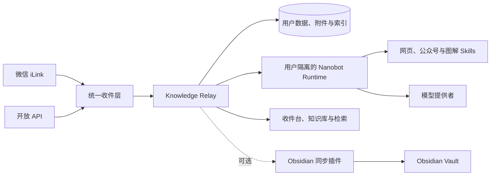

# 知流 · Knowledge Relay

[](https://github.com/qianshulab/knowledge-relay/actions/workflows/ci.yml)
[](https://github.com/qianshulab/knowledge-relay/releases/latest)
[](https://github.com/qianshulab/knowledge-relay/pkgs/container/knowledge-relay)
[](./LICENSE)

知流是一套开源、可自托管的知识收件与整理系统。它接收来自微信 iLink 和开放 API 的文字、链接与附件，保存原始内容，解析网页和微信公众号文章，并将整理结果沉淀为可检索、可阅读、可同步的个人知识资源。

系统内置收件台、知识库、全文检索、文章阅读、附件预览和智能图解。Obsidian 是可选的同步目标；不使用 Obsidian 时，全部收件、整理和阅读功能仍可独立运行。

## 主要功能

| 功能 | 说明 |
|---|---|
| 微信收件 | 接收微信 iLink Bot 中的文字、链接、图片、语音、视频和文件 |
| API 收件 | 使用用户级令牌提交文本或链接，支持幂等外部 ID |
| 网页解析 | 提取普通网页与微信公众号正文，生成 Markdown 快照并缓存正文图片 |
| 内容整理 | 生成标题、摘要、内容形态、主题、标签、领域、知识点和工具信息 |
| 收件台 | 查看处理进度、失败原因、附件、同步状态，并支持重新整理、归档和永久删除 |
| 知识库 | 按内容形态和动态主题浏览已整理内容，支持搜索、筛选和独立阅读页 |
| 内容检索 | 将自然语言查询转换为受限检索计划，并在当前用户的本地索引中匹配内容 |
| 智能图解 | 按需生成关系图、流程图、对比图、时间线或思维导图，并缓存生成结果 |
| Obsidian 同步 | 增量同步笔记、原始附件、派生 Markdown 和正文图片，支持断点重试与修订更新 |
| 多用户 | 邀请制加入；用户数据、接入通道、令牌、搜索索引和 Nanobot Workspace 相互隔离 |
| 运维工具 | 提供 Docker 部署、升级、备份、恢复和只读诊断脚本 |

模型或 Nanobot 暂时不可用时，知流仍会保存原始内容并保留后续重新整理入口，不会阻塞收件。

## 系统架构



| 组件 | 职责 |
|---|---|
| Knowledge Relay | 用户权限、内容接收、数据持久化、附件管理、搜索索引、管理页面和同步协议 |
| Nanobot Runtime | 模型调用、Agent Loop、网页解析、文档处理和执行型 Skills |
| Obsidian 插件 | 拉取增量批次、校验附件、写入 Vault、更新托管区块并确认同步游标 |

Docker 部署由两个容器组成：

- `knowledge-relay`：管理页面、业务 API、SQLite、附件和同步服务。
- `nanobot`：模型目录、整理 Runtime、检索 Runtime、Skills 和用户 Workspace。

宿主机只发布管理服务端口，Nanobot 的 `8900`、`8901` 和 `8902` 端口仅在 Docker 内部网络使用。

## 部署方式

| 方式 | 适用场景 | 更新方式 |
|---|---|---|
| Docker 成品镜像 | 长期运行、家庭服务器、NAS、Linux 主机 | `scripts/update-docker.sh` |
| Docker 本地构建 | 修改 Dockerfile、Runtime 或内置 Skills | 重新构建镜像 |
| 源码部署 | 开发、调试或本机体验 | 拉取源码后重新构建 |

生产环境推荐使用 Docker 成品镜像。

## Docker 部署

### 环境要求

- Git
- Docker Engine 或 Docker Desktop
- Docker Compose v2（`docker compose`）
- OpenSSL，用于首次部署时生成 Runtime 内部鉴权密钥
- 可访问 GitHub Container Registry、微信 iLink、所选模型提供者及需要解析的网页

镜像支持 `linux/amd64` 和 `linux/arm64`：

- `ghcr.io/qianshulab/knowledge-relay`
- `ghcr.io/qianshulab/knowledge-relay-nanobot`

### 首次部署

```bash
git clone https://github.com/qianshulab/knowledge-relay.git
cd knowledge-relay
cp .env.example .env
```

建议在 `.env` 中固定正式版本：

```dotenv
KNOWLEDGE_RELAY_IMAGE_TAG=1.9.0
```

启动服务：

```bash
./scripts/deploy-docker.sh
```

部署脚本会检查 Docker、生成 Nanobot 内部鉴权密钥、拉取两个镜像、创建持久化存储并启动服务。

脚本会自动判断当前账号是否需要 `sudo` 才能访问 Docker。请使用部署目录的普通文件所有者运行脚本，不要在脚本前直接添加 `sudo`。

默认访问地址：

- 当前主机：<http://127.0.0.1:8787>
- 局域网设备：`http://<服务器IP>:8787`

检查服务：

```bash
docker compose ps
curl --fail http://127.0.0.1:8787/health
```

两个服务均使用 `restart: unless-stopped`。服务器正常关机并重新启动后，Docker 会自动恢复容器；手动停止的容器不会自动启动。

### 网络绑定

Docker 默认将管理页面发布到宿主机全部网络接口：

```dotenv
KNOWLEDGE_RELAY_BIND_ADDRESS=0.0.0.0
PORT=8787
```

也可以绑定固定地址或仅允许本机访问：

```dotenv
# 绑定服务器的固定局域网地址
KNOWLEDGE_RELAY_BIND_ADDRESS=192.168.1.20

# 仅允许服务器本机访问
KNOWLEDGE_RELAY_BIND_ADDRESS=127.0.0.1
```

修改 `.env` 后重建主服务端口映射：

```bash
docker compose up -d --no-build knowledge-relay
```

宿主机防火墙只需按实际使用范围开放 `PORT` 对应的 TCP 端口。Nanobot 的内部端口不应映射到宿主机。

### HTTPS 与反向代理

局域网内可直接使用 HTTP。通过域名、互联网或 Obsidian 远程连接时应配置 HTTPS，并在 `.env` 中填写公开地址：

```dotenv
PUBLIC_BASE_URL=https://inbox.example.com
```

Nginx 示例：

```nginx
server {
    listen 443 ssl http2;
    server_name inbox.example.com;

    ssl_certificate     /etc/letsencrypt/live/inbox.example.com/fullchain.pem;
    ssl_certificate_key /etc/letsencrypt/live/inbox.example.com/privkey.pem;

    client_max_body_size 110m;
    proxy_read_timeout 3600s;
    proxy_send_timeout 3600s;

    location / {
        proxy_pass http://127.0.0.1:8787;
        proxy_set_header Host $host;
        proxy_set_header X-Forwarded-Proto https;
        proxy_set_header X-Forwarded-For $proxy_add_x_forwarded_for;
        proxy_set_header X-Real-IP $remote_addr;
    }
}
```

反向代理地址、浏览器访问地址和 `PUBLIC_BASE_URL` 的协议与域名必须一致，否则修改类请求会被来源校验拒绝。

### Docker 本地构建

本地构建会初始化全部 Git submodule，并构建主服务与 Nanobot 镜像：

```bash
KNOWLEDGE_RELAY_LOCAL_BUILD=1 ./scripts/deploy-docker.sh
```

## 源码部署

源码部署适合开发和调试。长期运行建议使用 Docker。

环境要求：Node.js 22.13+、npm、Python 3.11+、Git 和 Python `venv`。

```bash
git clone --recurse-submodules https://github.com/qianshulab/knowledge-relay.git
cd knowledge-relay
./scripts/deploy-source.sh
```

脚本会创建 `.nanobot-venv`、安装固定版本的 Nanobot、安装 Node.js 依赖、初始化 Skills、完成构建并以前台方式启动服务。源码部署默认监听 <http://127.0.0.1:8787>。

开发模式：

```bash
npm ci
npm run setup:nanobot
npm run dev
```

## 首次配置

首次访问管理页面时创建管理员账户。用户名和密码均由部署者设置；默认用户名输入框为 `owner`，系统不提供预设密码。

推荐按以下顺序完成配置：

1. 创建管理员账户。
2. 在“系统设置 → AI 智能整理”配置模型提供者、模型和认证信息。
3. 在“系统设置 → Nanobot Skills”确认网页与公众号 Skills 已启用。
4. 在“系统设置 → 微信接入”扫描二维码连接 iLink Bot。
5. 发送一条文字和一条网页链接，确认收件、解析和整理状态。
6. 按需要配置 API 收件、成员邀请和 Obsidian 同步。

从早期个人版升级时，原管理员用户名为 `owner`，显示名称和密码保持不变。

## 模型与 Nanobot

模型提供者、模型标识和认证信息由管理员在管理页面配置，配置写入 Nanobot 的持久化数据目录。Knowledge Relay 只连接本机或 Docker 内部的 Nanobot Runtime，不直接调用远程模型接口。

### API Key

在“系统设置 → AI 智能整理”中选择提供者，填写 API 地址、模型和 API Key，保存后执行“检查基础连接”。支持模型目录接口的提供者可以从页面读取在线模型列表。

也可以在首次部署前通过 `.env` 提供 DeepSeek Key：

```dotenv
DEEPSEEK_API_KEY=
```

成品镜像不包含任何模型凭据。

### OpenAI 账户授权

Docker 环境无法从管理页面直接完成浏览器 OAuth。需要在部署终端内执行 Nanobot 提供的账户登录流程，再重新加载 Runtime：

```bash
docker compose exec nanobot \
  nanobot provider login openai-codex \
  --set-main \
  --model openai-codex/gpt-5.6-sol \
  --config /nanobot/config.json

docker compose restart nanobot
```

终端会显示授权地址和后续步骤。可用模型以授权账户和 Nanobot 实际返回的目录为准。

### 处理状态与降级

- 基础连接测试验证 Runtime、提供者认证和一次最小请求。
- 网页解析任务还包含抓取、脚本执行、正文转换、图片缓存和模型整理，耗时通常更长。
- Runtime 持续产生新步骤时任务会继续等待；长时间没有进展才判定停滞。
- 最终失败时保留原始收件，用户可以在详情页重新整理。

## Nanobot Skills

Docker 和源码部署均固定安装以下原版 Skills：

| Skill | 用途 |
|---|---|
| [`wechat-article-extractor`](https://github.com/freestylefly/wechat-article-extractor-skill) | 微信公众号文章提取 |
| [`fetch-skill`](https://github.com/aresbit/fetch-skill) | 普通网页读取与 Markdown 转换 |
| [`mermaid-visualizer`](https://github.com/axtonliu/axton-obsidian-visual-skills/tree/main/mermaid-visualizer) | Mermaid 流程图、关系图、思维导图和时序图 |
| [`obsidian-canvas-creator`](https://github.com/axtonliu/axton-obsidian-visual-skills/tree/main/obsidian-canvas-creator) | 可编辑 Obsidian Canvas |
| [`excalidraw-diagram`](https://github.com/axtonliu/axton-obsidian-visual-skills/tree/main/excalidraw-diagram) | Excalidraw 图表 |

后台显示的 Nanobot Skill 内容来自实际 Runtime Workspace。管理员可以查看、启停或修改；修改只影响之后提交的任务。

智能图解在用户首次打开时生成，并与当前内容版本一起保存。再次打开直接读取已保存结果；重新整理正文后，旧图解失效，用户可按需重新生成。

第三方组件的固定版本、许可证和网络行为见 [THIRD_PARTY.md](./THIRD_PARTY.md)。

## 微信接入

每个用户单独扫描二维码并建立自己的 iLink 连接。微信消息先写入数据库，再进入异步整理队列；附件下载或模型异常不会阻塞后续消息游标。

发送者限制由 `ILINK_ALLOW_FROM` 控制：

```dotenv
# 留空：仅允许扫码连接者本人
ILINK_ALLOW_FROM=

# 允许指定用户，多个 ID 使用逗号分隔
ILINK_ALLOW_FROM=user_a,user_b

# 允许全部发送者
ILINK_ALLOW_FROM=*
```

默认单个微信附件上限为 100 MB，可通过 `ILINK_MAX_MEDIA_MB` 调整。

## API 收件

用户可在“系统设置 → API 收件”创建独立令牌。API 令牌与登录会话、Obsidian 同步令牌互不通用，并可随时撤销。

提交链接：

```bash
curl -X POST 'https://inbox.example.com/api/captures' \
  -H 'Authorization: Bearer capture_xxx' \
  -H 'Content-Type: application/json' \
  -d '{
    "externalId": "bookmark-2026-001",
    "url": "https://example.com/article",
    "text": "稍后阅读"
  }'
```

提交纯文本：

```bash
curl -X POST 'https://inbox.example.com/api/captures' \
  -H 'Authorization: Bearer capture_xxx' \
  -H 'Content-Type: application/json' \
  -d '{
    "externalId": "note-2026-001",
    "text": "需要整理的内容"
  }'
```

首次接收返回 `202 Accepted`。同一令牌重复提交相同 `externalId` 时返回已有资源，不会重复入库。完整字段和响应格式见 [docs/API.md](./docs/API.md)。

## 多用户与权限

- 系统不开放匿名注册，成员通过管理员生成的一次性邀请链接加入。
- 管理员负责模型提供者、全局执行型 Skills、插件发布和成员管理。
- 成员只能访问自己的消息、附件、搜索结果、微信连接、API 令牌和 Obsidian 连接。
- 每个活跃用户使用独立 Nanobot Runtime、Workspace、sessions 和 artifacts。
- 空闲 Runtime 可以自动回收，用户数据和 Workspace 不会随进程退出而删除。
- 管理员可以搜索、停用、恢复或永久删除成员。
- 停用成员会撤销会话并停止其接入和同步；永久删除会清理该成员的内容、附件、图解、连接和 Runtime Workspace。

当前数据层采用单机 SQLite，适合单节点自托管。不要让多个 Knowledge Relay 实例同时写入同一个数据库文件。

## 知识库、检索与阅读

收件台保存全部接收记录和处理状态。完成整理的内容进入知识库，可按以下维度浏览：

- 内容形态：文章、文档、图片、音视频、任务、想法等稳定类型。
- 动态主题：根据当前用户已整理内容聚合出的主题标签。
- 领域、知识点与工具：用于检索和知识图谱，不替代文章正文。

详情页提供文章正文、整理笔记、延伸整理、原始内容、附件和智能图解。公众号与网页正文图片会在收件时缓存为用户附件，阅读页面和 Obsidian 均引用本地副本；图片缓存失败不会丢弃正文。

检索服务只在当前用户的数据索引中查询，不提供开放式通用对话，也不执行删除、修改或系统命令。

## Obsidian 同步

插件由独立仓库维护：[qianshulab/knowledge-relay-obsidian](https://github.com/qianshulab/knowledge-relay-obsidian)。管理页面可下载当前服务端发布的插件包。

配置步骤：

1. 在“系统设置 → Obsidian 同步”下载插件 ZIP。
2. 将 ZIP 解压到 Vault 的 `.obsidian/plugins/wechat-ilink-inbox-sync/`。
3. 在 Obsidian 中启用“知流同步”。
4. 在服务端创建 Obsidian 连接并复制同步令牌。
5. 在插件设置中填写服务器地址、同步令牌和收件箱目录。
6. 执行一次手动同步，确认笔记与附件路径。

非本机 HTTP 地址不会发送同步令牌。跨设备连接请使用 HTTPS。

同步协议提供：

- 服务端资源 ID 与 Obsidian 笔记的稳定映射。
- 托管区块更新，不覆盖用户自行编辑的区域。
- 批次确认、断点重试、附件 SHA-256 校验和幂等写入。
- 标题修订、原始附件、派生 Markdown、正文图片和 Canvas 同步。
- 服务端永久删除后的受控清理语义。

协议说明见 [docs/API.md](./docs/API.md) 和 [docs/SYNC-AUDIT.md](./docs/SYNC-AUDIT.md)。

## 配置参考

完整模板见 [.env.example](./.env.example)。Docker 会覆盖容器内部的 `HOST`、`DATA_DIR` 和 Nanobot 内部地址；宿主机端口和绑定地址仍由 `.env` 控制。

### 服务与数据

| 变量 | 默认值 | 说明 |
|---|---:|---|
| `HOST` | `127.0.0.1` | 源码部署监听地址；Docker 容器内固定为 `0.0.0.0` |
| `PORT` | `8787` | 源码服务端口或 Docker 宿主机端口 |
| `KNOWLEDGE_RELAY_BIND_ADDRESS` | `0.0.0.0` | Docker 端口绑定地址 |
| `KNOWLEDGE_RELAY_IMAGE_TAG` | `latest` | 两个成品镜像的版本标签，生产环境建议固定版本 |
| `KNOWLEDGE_RELAY_BACKUP_DIR` | `./backups` | Docker 备份输出目录 |
| `DATA_DIR` | `./data` | 数据库、附件和应用加密密钥目录 |
| `PUBLIC_BASE_URL` | 空 | HTTPS 公开地址，用于来源校验和外部连接 |
| `SESSION_DAYS` | `30` | 登录会话有效期 |
| `LOG_LEVEL` | `info` | `debug`、`info`、`warn` 或 `error` |

### 微信与业务 Webhook

| 变量 | 默认值 | 说明 |
|---|---:|---|
| `ILINK_ALLOW_FROM` | 空 | 允许发送消息的微信用户 ID；空表示扫码者本人，`*` 表示全部 |
| `ILINK_APP_ID` | `bot` | iLink 应用标识 |
| `ILINK_BOT_AGENT` | `WechatInbox/0.1.0` | iLink 客户端标识 |
| `ILINK_BASE_URL` | 微信 iLink 地址 | iLink API 地址 |
| `ILINK_CDN_BASE_URL` | 微信 CDN 地址 | 附件下载地址 |
| `ILINK_LONG_POLL_MS` | `35000` | 微信长轮询时长 |
| `ILINK_MAX_MEDIA_MB` | `100` | 单个微信附件大小上限 |
| `PROCESS_WEBHOOK_URL` | 空 | 可选的外部业务处理地址 |
| `PROCESS_WEBHOOK_SECRET` | 空 | Webhook 签名密钥 |
| `PROCESS_WEBHOOK_TIMEOUT_MS` | `30000` | Webhook 请求超时 |
| `AUTO_ACK` | `false` | 无业务回复时是否发送微信确认消息 |
| `AUTO_ACK_TEXT` | `已收到并保存。` | 默认确认文本 |

### Nanobot Runtime

| 变量 | 默认值 | 说明 |
|---|---:|---|
| `NANOBOT_RUNTIME_API_KEY` | 首次部署生成 | 主服务与 Runtime 的内部鉴权密钥 |
| `NANOBOT_BASE_URL` | `http://127.0.0.1:8900/v1/` | 整理 Runtime 地址；Docker 内部自动覆盖 |
| `NANOBOT_SEARCH_BASE_URL` | `http://127.0.0.1:8902/v1/` | 检索 Runtime 地址；Docker 内部自动覆盖 |
| `NANOBOT_CATALOG_URL` | `http://127.0.0.1:8901/` | 模型目录服务地址；Docker 内部自动覆盖 |
| `NANOBOT_API_KEY` | 空 | 主服务访问本机 Runtime 的鉴权信息 |
| `NANOBOT_MANAGED` | `true` | 是否由源码进程托管 Runtime；Docker 自动设为 `false` |
| `NANOBOT_AUTO_RELOAD` | `true` | 配置变更后是否自动重载 Runtime |
| `NANOBOT_CONFIG` | `./data/nanobot/config.json` | Nanobot 配置文件路径 |
| `NANOBOT_WORKSPACE` | `./data/nanobot/workspace` | Nanobot Workspace 路径 |
| `NANOBOT_TIMEOUT_MS` | `120000` | 单次基础请求超时 |
| `NANOBOT_PROCESS_IDLE_TIMEOUT_MS` | `900000` | 整理任务连续无新步骤时的停滞判定时间 |
| `NANOBOT_PROCESS_MAX_TIMEOUT_MS` | `21600000` | 单次整理任务灾难性安全上限，默认 6 小时 |
| `NANOBOT_SERVE_TIMEOUT` | `28800` | Runtime 请求上限，默认 8 小时 |
| `NANOBOT_MAX_TENANT_RUNTIMES` | `12` | 同时驻留的用户 Runtime 数量上限 |
| `NANOBOT_TENANT_IDLE_MS` | `1800000` | 用户 Runtime 空闲回收时间 |
| `DEEPSEEK_API_KEY` | 空 | 可选的首次 DeepSeek 凭据 |

### 同步

| 变量 | 默认值 | 说明 |
|---|---:|---|
| `SYNC_BATCH_SIZE` | `100` | 单次 Obsidian 同步批次大小，最大 500 |

## 数据与持久化

Docker 部署使用两类持久化存储：

| 位置 | 内容 |
|---|---|
| `./data/` | SQLite 数据库、附件、插件发布包和 `app-secret.key` |
| Docker volume `nanobot-data` | 模型配置、用户 Workspace、Skills、sessions 和 artifacts |

`data/inbox.sqlite` 与 `data/app-secret.key` 属于同一加密数据集，备份和恢复时必须保持配对。删除容器不会删除这些数据；执行 `docker compose down -v` 会删除 Nanobot volume，不应作为普通停止命令使用。

## 日常运维

### 状态与日志

```bash
docker compose ps
docker compose logs -f --tail=200
docker compose logs --since=10m --tail=200 knowledge-relay nanobot
```

### 启动、停止与重启

```bash
docker compose stop
docker compose start
docker compose restart
```

只重启一个服务：

```bash
docker compose restart knowledge-relay
docker compose restart nanobot
```

### 升级

升级脚本会先备份应用数据、Nanobot volume 和 `.env`，再更新镜像标签、拉取两个镜像、重建容器并执行健康检查。

```bash
cd /你的部署目录/knowledge-relay
git fetch --tags origin main:refs/remotes/origin/main
git checkout main
git pull --ff-only origin main
chmod +x scripts/update-docker.sh
./scripts/update-docker.sh 1.9.0
```

早期部署若只检出了版本标签、本地不存在 `main` 分支，先执行：

```bash
git fetch --tags origin main:refs/remotes/origin/main
git checkout -b main --track origin/main
```

升级脚本会自动判断当前账号是否需要 `sudo` 才能访问 Docker。请用部署目录的普通文件所有者运行脚本，不要在脚本前直接添加 `sudo`。

升级不需要执行 `docker compose down`。完成后检查：

```bash
docker compose ps
docker compose logs --since=5m --tail=200 knowledge-relay nanobot
```

### 旧版本没有升级脚本

```bash
cd /你的部署目录/knowledge-relay
git fetch --tags origin main:refs/remotes/origin/main
git checkout -b main --track origin/main
git pull --ff-only origin main
chmod +x scripts/update-docker.sh
./scripts/update-docker.sh 1.9.0
```

如果 `main` 已存在，将 `git checkout -b main --track origin/main` 替换为 `git checkout main`。

### 备份

```bash
./scripts/backup-docker.sh
```

备份脚本会短暂停止两个容器，创建一致性归档并恢复原运行状态。默认输出到 `./backups/knowledge-relay-<UTC时间>/`。

备份包含：

- `data.tar.gz`：数据库、附件和应用密钥。
- `nanobot.tar.gz`：模型配置、Workspace、Skills 和 Runtime artifacts。
- `environment.env` 与 `compose.yaml`：部署参数和镜像版本。
- `SHA256SUMS`：归档完整性校验。

可将备份写入独立存储：

```dotenv
KNOWLEDGE_RELAY_BACKUP_DIR=/volume1/backups/knowledge-relay
```

### 恢复与版本回退

```bash
./scripts/restore-docker.sh \
  ./backups/knowledge-relay-20260821T010203Z \
  --confirm
```

恢复脚本会验证 SHA-256、再次备份当前状态、保留恢复前的 `data/` 与 `.env`，然后恢复应用数据、Nanobot volume 和镜像版本。数据库升级可能包含不可逆结构变化，因此版本回退应恢复对应版本的完整备份，不应只替换旧镜像标签。

### 部署诊断

```bash
./scripts/doctor-docker.sh
```

诊断脚本为只读操作，检查 Compose 配置、容器状态、应用健康、整理与检索 Runtime、模型目录、数据目录写权限和磁盘容量。它不会输出模型凭据、同步令牌或用户内容。

## 安全边界

| 范围 | 默认措施 |
|---|---|
| 管理页面 | 登录会话、来源校验、登录限速和安全响应头 |
| 用户数据 | 消息、附件、索引、微信连接和同步连接均按用户过滤 |
| Nanobot | 独立容器；每个活跃用户使用独立进程与 Workspace |
| Runtime 端口 | 仅在 Docker 内部网络开放，不发布到宿主机 |
| API 与 Obsidian | 使用不同的用户级令牌，可独立撤销 |
| 网页图片 | 入库时校验并缓存为本地附件，不在阅读时自动加载远程图片 |
| Skills | 固定上游提交，随镜像构建，不在运行时下载未知代码 |
| 成员加入 | 一次性邀请，不开放匿名注册 |

公网部署应使用 HTTPS、限制管理页面访问范围并定期备份。完整说明见 [SECURITY.md](./SECURITY.md) 和 [PRIVACY.md](./PRIVACY.md)。

## 故障排查

### 管理页面无法访问

```bash
docker compose ps
docker compose logs --tail=200 knowledge-relay
curl -v http://127.0.0.1:8787/health
```

检查宿主机端口占用、`KNOWLEDGE_RELAY_BIND_ADDRESS`、防火墙和反向代理配置。

### 页面提示“请求来源不受信任”

确认浏览器访问地址与 `PUBLIC_BASE_URL` 完全一致，并确保反向代理传递正确的 `Host` 和 `X-Forwarded-Proto`。

### 模型列表正常，但整理任务失败

基础连接正常不代表完整网页任务已经完成。检查两个容器日志、Nanobot Runtime 状态、模型额度、目标网页连通性和 Skill 启用状态：

```bash
docker compose logs --since=20m --tail=300 knowledge-relay nanobot
./scripts/doctor-docker.sh
```

### 容器无法访问互联网

分别在两个容器内测试 HTTPS：

```bash
docker compose exec knowledge-relay node -e \
  'fetch("https://www.baidu.com", {signal: AbortSignal.timeout(10000)}).then(r => console.log(r.status)).catch(console.error)'

docker compose exec nanobot python -c \
  'import urllib.request; print(urllib.request.urlopen("https://api.deepseek.com", timeout=10).status)'
```

若宿主机可以访问而容器超时，应检查宿主机 Docker 转发、防火墙和容器出站规则。Docker daemon 的镜像拉取代理与容器运行时代理属于不同配置范围。

### 管理员无法登录

早期版本升级后的管理员用户名为 `owner`，密码保持原值。确认数据库中是否存在管理员：

```bash
docker compose exec -T knowledge-relay node --experimental-sqlite -e '
const { DatabaseSync } = require("node:sqlite");
const db = new DatabaseSync("/app/data/inbox.sqlite", { readOnly: true });
console.log(db.prepare("SELECT username, display_name, role FROM users").all());
'
```

如果 `/api/bootstrap` 返回 `needsSetup: true`，说明当前服务加载的是空数据目录，应先检查 `./data:/app/data` 挂载，不要直接创建新管理员。

### 微信没有收到新消息

检查微信连接状态、允许发送者、iLink 长轮询日志和附件大小限制。重新扫码前先确认现有连接是否仍有效，避免创建重复连接。

### Obsidian 不同步

检查插件服务器地址、HTTPS、连接令牌、同步目标状态和 Obsidian 开发者控制台。同步令牌撤销后需要在服务端创建新连接并更新插件设置。

问题反馈：[GitHub Issues](https://github.com/qianshulab/knowledge-relay/issues)

## 开发与验证

```bash
npm ci
npm run typecheck
npm test
npm run build
npm run package:plugin
npm run verify
```

发布流水线会执行完整验证、生产依赖审计、敏感凭据模式扫描、多架构镜像构建和成品双容器健康检查。

## 项目文档

- [架构与演进边界](./docs/ARCHITECTURE.md)
- [API 文档](./docs/API.md)
- [知识检索设计](./docs/KNOWLEDGE-RETRIEVAL.md)
- [同步一致性审计](./docs/SYNC-AUDIT.md)
- [安全策略](./SECURITY.md)
- [隐私说明](./PRIVACY.md)
- [第三方组件](./THIRD_PARTY.md)
- [更新记录](./CHANGELOG.md)
- [贡献指南](./CONTRIBUTING.md)

## 许可证

Knowledge Relay 按 [MIT License](./LICENSE) 开源。第三方组件继续遵循各自许可证，详见 [THIRD_PARTY.md](./THIRD_PARTY.md)。
