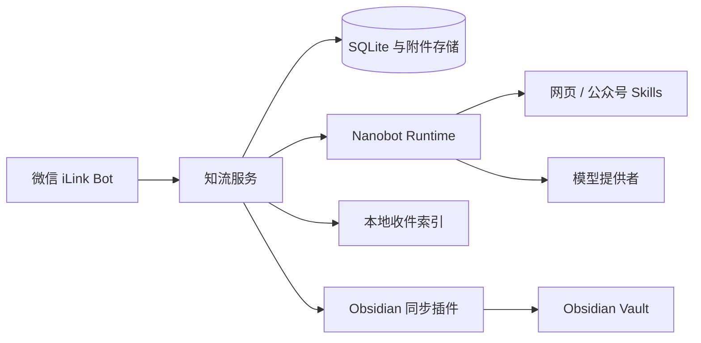

# 知流 · Knowledge Relay

[](https://github.com/qianshulab/knowledge-relay/actions/workflows/ci.yml)
[](https://github.com/qianshulab/knowledge-relay/releases/latest)
[](https://github.com/qianshulab/knowledge-relay/pkgs/container/knowledge-relay)
[](./LICENSE)

把微信里的碎片内容，可靠地汇入你的个人知识系统。

知流是一个开源、可自托管的个人知识收件台。它接收发送给微信 iLink Bot 的文字、链接和附件，通过官方 Nanobot Runtime 完成网页解析与智能整理，并增量同步到指定的 Obsidian 收件箱。

当前发行面向个人部署，采用单用户数据模型。Docker 默认允许宿主机网络访问，源码部署默认仅监听本机地址。

## 核心能力

- **微信内容捕获**：接收文字、图片、语音、视频和文件，完成附件下载、解密与校验。
- **智能整理**：提取标题、摘要、分类、标签、专业领域、知识点和相关工具。
- **网页与公众号解析**：由 Nanobot 调用固定版本的原版 Skills，将正文转换为 Markdown 派生附件。
- **知识化浏览**：通过领域、知识点和工具聚合历史内容，并支持组合筛选。
- **收件检索**：AI 先理解自然语言需求并生成受限计划，再由本地索引匹配真实收件内容。
- **Obsidian 增量同步**：支持批次确认、断点重试、永久 ID 去重、修订更新和附件 SHA-256 校验。
- **可靠降级**：模型未配置或暂时不可用时仍保存原文并继续同步，不阻塞收件流程。
- **本地数据边界**：SQLite 保存业务数据；模型调用与执行型 Skills 运行在独立的 Nanobot 容器中。

## 系统架构



| 组件 | 职责 |
|---|---|
| Knowledge Relay | 接收消息、持久化、索引、管理后台与同步协议 |
| Nanobot Runtime | Agent Loop、模型调用、工具与 Skills 执行 |
| Obsidian 插件 | 拉取增量批次、校验附件、写入 Vault 并确认归档 |

Nanobot 是模型与工具的统一执行边界。收件检索仅查询本地索引，不开放通用对话和数据写入能力。

## 快速开始

### Docker 部署（推荐）

要求：Git、Docker Engine 和 Docker Compose v2。

```bash
git clone https://github.com/qianshulab/knowledge-relay.git
cd knowledge-relay
./scripts/deploy-docker.sh
```

部署脚本会初始化本地配置、生成 Runtime 内部鉴权密钥并启动两个容器。Docker 默认发布到宿主机的所有网络接口：

- 本机：<http://127.0.0.1:8787>
- 局域网设备：`http://<主机IP>:8787`

检查运行状态：

```bash
docker compose ps
curl --fail http://127.0.0.1:8787/health
```

镜像发布于 GitHub Container Registry：

- `ghcr.io/qianshulab/knowledge-relay:latest`
- `ghcr.io/qianshulab/knowledge-relay-nanobot:latest`

镜像支持 `linux/amd64` 和 `linux/arm64`，不包含模型凭据。模型认证信息由部署者在本地配置。

### 网络绑定

Docker 的绑定地址由 `.env` 中的 `KNOWLEDGE_RELAY_BIND_ADDRESS` 控制。

```dotenv
# 允许同一局域网访问（默认）
KNOWLEDGE_RELAY_BIND_ADDRESS=0.0.0.0
PORT=8787

# 或绑定宿主机的固定地址
KNOWLEDGE_RELAY_BIND_ADDRESS=192.168.1.20

# 或限制为本机访问
KNOWLEDGE_RELAY_BIND_ADDRESS=127.0.0.1
```

也可以在首次部署时临时指定：

```bash
KNOWLEDGE_RELAY_BIND_ADDRESS=192.168.1.20 PORT=8787 ./scripts/deploy-docker.sh
```

局域网 HTTP 可用于管理页面。Obsidian 插件连接非本机地址时要求 HTTPS；配置反向代理与证书后，将域名转发到 `127.0.0.1:8787`，并设置：

```dotenv
PUBLIC_BASE_URL=https://inbox.example.com
```

本地构建镜像：

```bash
KNOWLEDGE_RELAY_LOCAL_BUILD=1 ./scripts/deploy-docker.sh
```

### 源码部署

要求：Node.js 22.13+、npm、Python 3.11+，适用于 macOS 和 Linux。

```bash
git clone --recurse-submodules https://github.com/qianshulab/knowledge-relay.git
cd knowledge-relay
./scripts/deploy-source.sh
```

开发模式：

```bash
npm ci
npm run setup:nanobot
npm run dev
```

## 首次配置

1. 打开管理页面并创建本地管理员账户。
2. 在“系统设置 → AI 智能整理”选择模型提供者、模型和认证方式。
3. 在“系统设置 → 微信接入”扫码连接自己的 iLink Bot。
4. 在“系统设置 → Skills”确认网页和公众号 Skills 已启用。
5. 给机器人发送一条测试消息，在收件台确认原文、整理状态和附件。
6. 打开“Obsidian 同步”，下载插件、创建连接并填写连接令牌。

模型配置为可选项。未配置模型时，原始内容的接收、存储和同步保持可用。

## Nanobot 与 Skills

知流使用官方 Nanobot 作为 Agent Runtime。模型提供者、模型与认证信息均在后台配置；支持模型目录 API 的提供者可以直接读取在线模型列表。

Runtime 内置两个执行型 Skills：

- [`wechat-article-extractor`](https://github.com/freestylefly/wechat-article-extractor-skill)：微信公众号文章提取。
- [`fetch-skill`](https://github.com/aresbit/fetch-skill)：普通网页读取与 Markdown 转换。

依赖和运行环境已包含在 Nanobot 镜像中。Skill 的版本、许可证和外部网络行为记录在 [THIRD_PARTY.md](./THIRD_PARTY.md)。

## Obsidian 同步

插件由独立仓库维护：[qianshulab/knowledge-relay-obsidian](https://github.com/qianshulab/knowledge-relay-obsidian)。管理后台提供已验证插件包的下载与发布入口。

同步协议提供：

- 服务端消息 ID 与 Obsidian 笔记的稳定映射。
- 托管区块修订更新，不覆盖用户编辑区。
- 批次确认、断点重试和幂等写入。
- 原始附件与派生 Markdown 的完整性校验。
- 成功同步后的服务端归档与增量拉取。

协议细节见 [API 文档](./docs/API.md) 和 [同步审计](./docs/SYNC-AUDIT.md)。

## 配置

常用环境变量如下，完整配置见 [.env.example](./.env.example)。

| 变量 | 默认值 | 说明 |
|---|---:|---|
| `HOST` | `127.0.0.1` | 源码部署时的监听地址 |
| `PORT` | `8787` | 源码服务端口或 Docker 宿主机端口 |
| `KNOWLEDGE_RELAY_BIND_ADDRESS` | `0.0.0.0` | Docker 在宿主机发布端口的绑定地址 |
| `DATA_DIR` | `./data` | 数据库、附件和本机密钥目录 |
| `PUBLIC_BASE_URL` | 空 | 公网部署时使用的 HTTPS 地址 |
| `SESSION_DAYS` | `30` | 管理页面登录会话有效期 |
| `ILINK_ALLOW_FROM` | 扫码者本人 | 允许发送消息的微信用户 ID |
| `ILINK_MAX_MEDIA_MB` | `100` | 单个微信附件大小上限 |
| `NANOBOT_RUNTIME_API_KEY` | Docker 必填 | 主服务与 Runtime 之间的内部鉴权密钥 |
| `DEEPSEEK_API_KEY` | 空 | 可选的初始模型凭据，也可在后台配置 |
| `SYNC_BATCH_SIZE` | `100` | 单次 Obsidian 同步的最大消息数 |
| `KNOWLEDGE_RELAY_IMAGE_TAG` | `latest` | 使用的成品镜像版本 |

## 日常运维

### 查看日志

```bash
docker compose logs -f --tail=200
```

### 升级

```bash
git pull --ff-only
docker compose pull
docker compose up -d --no-build
```

固定镜像版本：

```dotenv
KNOWLEDGE_RELAY_IMAGE_TAG=1.8.3
```

### 备份

备份范围：

- 宿主机 `data/`：数据库、附件、插件包和应用加密主密钥；
- Docker volume `nanobot-data`：模型配置、Workspace、Skills 和 Runtime artifacts。

`data/app-secret.key` 与 `data/inbox.sqlite` 构成同一加密数据集，恢复时需要保持配对。

## 安全边界

| 范围 | 默认边界 |
|---|---|
| 管理页面 | Docker 默认绑定 `0.0.0.0` 供局域网访问；源码部署默认绑定 `127.0.0.1` |
| Nanobot Runtime | 仅在容器内部网络提供服务，不映射宿主机端口 |
| Obsidian 连接 | 独立令牌，可在管理后台撤销 |
| 执行型 Skills | 固定上游版本，在独立 Runtime 容器中运行 |
| 用户模型 | 个人单用户；不包含公开注册和租户权限 |

安全报告与部署建议见 [SECURITY.md](./SECURITY.md)，数据处理范围见 [PRIVACY.md](./PRIVACY.md)。

## 故障排查

| 现象 | 检查项 |
|---|---|
| 无法访问管理页面 | `docker compose ps`、8787 端口占用、防火墙及服务是否只绑定本机 |
| Nanobot 状态异常 | `docker compose logs nanobot`、内部 Runtime Key、模型配置与网络连通性 |
| 能收件但没有智能整理 | 后台模型连接测试、模型额度、Skills 启用状态 |
| 微信没有新消息 | 微信连接状态、允许的发送者、iLink 长轮询日志 |
| Obsidian 没有同步 | 插件服务器地址、连接令牌、同步目标状态及插件日志 |

问题反馈：[GitHub Issues](https://github.com/qianshulab/knowledge-relay/issues)。日志中应移除连接令牌、模型凭据和个人内容。

## 项目文档

- [架构与演进边界](./docs/ARCHITECTURE.md)
- [知识检索设计](./docs/KNOWLEDGE-RETRIEVAL.md)
- [同步 API](./docs/API.md)
- [同步一致性审计](./docs/SYNC-AUDIT.md)
- [安全策略](./SECURITY.md)
- [隐私说明](./PRIVACY.md)
- [第三方组件](./THIRD_PARTY.md)
- [更新记录](./CHANGELOG.md)
- [贡献指南](./CONTRIBUTING.md)

## 许可证

知流本体按 [MIT License](./LICENSE) 开源。第三方组件继续遵循各自许可证，详见 [THIRD_PARTY.md](./THIRD_PARTY.md)。
