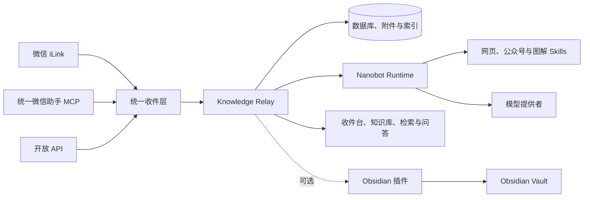

<div align="center">

<h1>知流 · Knowledge Relay</h1>

<p><strong>把散落在微信、网页和文件中的有用内容，沉淀为随时可查的个人知识库。</strong></p>

<p>
  <a href="https://github.com/qianshulab/knowledge-relay/actions/workflows/ci.yml"></a>
  <a href="https://github.com/qianshulab/knowledge-relay/releases/latest"></a>
  <a href="https://github.com/qianshulab/knowledge-relay/pkgs/container/knowledge-relay"></a>
  <a href="./LICENSE"></a>
</p>

<p>
  <a href="#快速部署">快速部署</a> ·
  <a href="#产品能力">功能说明</a> ·
  <a href="#功能配置">配置指南</a> ·
  <a href="#日常运维">运维指南</a> ·
  <a href="#常见问题">常见问题</a>
</p>

</div>

知流是一套开源、自托管的知识收件与整理系统。它接收来自微信 iLink、统一微信助手和开放 API 的文字、链接及附件，保存原始内容，解析网页和微信公众号文章，再将结果整理为可搜索、可阅读、可同步的个人知识资源。

网页端可以独立完成收件、整理、检索和阅读；Obsidian 是可选的同步目标，并非使用知流的前提。

## 产品能力

| 模块 | 能力 |
|---|---|
| 统一收件 | 接收微信 iLink、统一微信助手与开放 API 提交的文字、链接、图片、语音、视频和文件 |
| 网页解析 | 提取普通网页及微信公众号正文、原始封面和正文图片，生成可离线阅读的 Markdown 快照 |
| 智能整理 | 生成标题、摘要、内容形态、动态主题、标签、领域、知识点和工具信息 |
| 收件台 | 展示处理状态、失败原因、附件和同步结果，支持重新整理、归档与永久删除 |
| 知识库 | 按内容形态、主题和领域浏览已整理内容，并提供独立文章阅读页 |
| 内容检索 | 理解自然语言查询，在当前用户的本地内容索引中查找并归纳相关资料 |
| 知识问答 | 仅依据当前用户已整理的收藏内容进行持续问答，保存会话并提供可点击的资料依据 |
| 智能图解 | 按资料结构选择关系图、流程图、对比图、时间线、时序图、状态图或思维导图；支持缩放、搜索、节点解释与证据查看 |
| Obsidian 同步 | 增量同步笔记、原始附件、派生 Markdown 和正文图片，支持重试及修订更新 |
| 多用户 | 邀请制加入；支持用户搜索、密码重置、停用、删除和邀请记录分页，用户数据与 Nanobot Workspace 相互隔离 |

当模型或 Nanobot 暂时不可用时，知流仍会保存原始内容，并保留重新整理入口，不会阻塞后续收件。

## 系统架构



Docker 部署包含两个服务：

| 服务 | 职责 | 对外端口 |
|---|---|---|
| `knowledge-relay` | 管理页面、业务 API、用户权限、SQLite、附件、检索索引和同步协议 | `8787` |
| `nanobot` | 模型调用、Agent Loop、网页解析、文档处理、Skills 和用户 Workspace | 不对宿主机开放 |

Nanobot 的 `8900`、`8901` 和 `8902` 端口仅在 Docker 内部网络使用。

## 快速部署

### 运行要求

- Git
- Docker Engine 或 Docker Desktop
- Docker Compose v2（`docker compose`）
- OpenSSL
- 可访问 GitHub Container Registry、微信 iLink、所选模型提供者及需要解析的网页

成品镜像同时支持 `linux/amd64` 和 `linux/arm64`。

### 1. 获取项目

```bash
git clone https://github.com/qianshulab/knowledge-relay.git
cd knowledge-relay
cp .env.example .env
```

正式环境建议在 [Releases](https://github.com/qianshulab/knowledge-relay/releases/latest) 中确认当前稳定版本，并在 `.env` 中固定镜像标签：

```dotenv
KNOWLEDGE_RELAY_IMAGE_TAG=<稳定版本号>
```

### 2. 启动服务

```bash
./scripts/deploy-docker.sh
```

部署脚本会检查运行环境、生成 Nanobot 内部鉴权密钥、拉取两个镜像、创建持久化存储并启动服务。

脚本会自动判断当前账号是否需要通过 `sudo` 访问 Docker。请使用部署目录的普通文件所有者运行脚本，不要在脚本前添加 `sudo`。

### 3. 打开管理页面

- 当前主机：<http://127.0.0.1:8787>
- 局域网设备：`http://<服务器IP>:8787`

检查运行状态：

```bash
docker compose ps
curl --fail http://127.0.0.1:8787/health
```

首次打开页面时创建管理员账户。系统没有预设密码；用户名和密码均由部署者设置。

### 4. 完成初始化

1. 在“系统设置 → AI 智能整理”配置模型提供者，刷新模型列表并执行真实连接检查。
2. 在“系统设置 → 整理能力”确认所需 Skills 已启用。
3. 在“系统设置 → 收件接入”连接个人 iLink、配置统一微信助手，或创建开放 API 令牌。
4. 发送一条文字和一条网页链接，确认收件、解析与整理状态。
5. 按需配置 API 收件、成员邀请和 Obsidian 同步。

## 部署配置

### 网络绑定

Docker 默认将管理页面绑定到宿主机全部网络接口：

```dotenv
KNOWLEDGE_RELAY_BIND_ADDRESS=0.0.0.0
PORT=8787
```

可以按部署环境调整：

```dotenv
# 绑定宿主机的固定地址
KNOWLEDGE_RELAY_BIND_ADDRESS=192.168.1.20

# 只允许宿主机本地访问
KNOWLEDGE_RELAY_BIND_ADDRESS=127.0.0.1
```

修改端口或绑定地址后重新创建主服务：

```bash
docker compose up -d --no-build knowledge-relay
```

宿主机防火墙只需开放管理页面对应的 TCP 端口，不应将 Nanobot 内部端口发布到宿主机。

### HTTPS 与反向代理

跨设备或通过域名访问时建议启用 HTTPS，并在 `.env` 中填写实际公开地址：

```dotenv
PUBLIC_BASE_URL=https://inbox.example.com
```

Nginx 配置示例：

```nginx
server {
    listen 443 ssl http2;
    server_name inbox.example.com;

    ssl_certificate     /etc/letsencrypt/live/inbox.example.com/fullchain.pem;
    ssl_certificate_key /etc/letsencrypt/live/inbox.example.com/privkey.pem;

    client_max_body_size 110m;
    proxy_read_timeout 3600s;
    proxy_send_timeout 3600s;

    # 知识问答增量输出：关闭代理缓冲，收到一段就转发一段。
    location ~ ^/api/knowledge/chats/[^/]+/messages/stream$ {
        proxy_pass http://127.0.0.1:8787;
        proxy_http_version 1.1;
        proxy_set_header Connection "";
        proxy_set_header Host $host;
        proxy_set_header X-Forwarded-Proto https;
        proxy_set_header X-Forwarded-For $proxy_add_x_forwarded_for;
        proxy_set_header X-Real-IP $remote_addr;
        proxy_buffering off;
        proxy_cache off;
        gzip off;
    }

    location / {
        proxy_pass http://127.0.0.1:8787;
        proxy_http_version 1.1;
        proxy_set_header Host $host;
        proxy_set_header X-Forwarded-Proto https;
        proxy_set_header X-Forwarded-For $proxy_add_x_forwarded_for;
        proxy_set_header X-Real-IP $remote_addr;
    }
}
```

Caddy 配置示例：

```caddyfile
inbox.example.com {
    @knowledge_stream path_regexp knowledge_stream ^/api/knowledge/chats/[^/]+/messages/stream$
    reverse_proxy @knowledge_stream 127.0.0.1:8787 {
        flush_interval -1
    }
    reverse_proxy 127.0.0.1:8787
}
```

知流会为知识问答流返回 `Cache-Control: no-cache, no-transform`、`X-Accel-Buffering: no`，并定期发送心跳。若前面还使用了 CDN、WAF 或 NAS 自带的应用代理，也应对 `/api/knowledge/chats/*/messages/stream` 关闭缓存、压缩和响应缓冲，并把空闲读取超时设为 120 秒以上。

浏览器访问地址、反向代理地址和 `PUBLIC_BASE_URL` 的协议及域名必须一致，否则修改类请求会被来源校验拒绝。

### 本地构建 Docker 镜像

需要修改主程序、Runtime 或内置 Skills 时，可以直接从源码构建：

```bash
KNOWLEDGE_RELAY_LOCAL_BUILD=1 ./scripts/deploy-docker.sh
```

### 源码运行

源码方式适合开发和调试。需要 Node.js 22.13+、npm、Python 3.11+、Git 和 Python `venv`。

```bash
git clone --recurse-submodules https://github.com/qianshulab/knowledge-relay.git
cd knowledge-relay
./scripts/deploy-source.sh
```

源码部署默认监听 <http://127.0.0.1:8787>，长期运行建议使用 Docker。

## 功能配置

### 模型与 Nanobot

管理员可以在“系统设置 → AI 智能整理”配置模型提供者、API 地址、模型和认证信息。配置保存在 Nanobot 的持久化目录中；Knowledge Relay 只访问本机或 Docker 内部 Runtime，不绕过 Nanobot 直接执行整理任务。

成品镜像不包含任何模型凭据。首次部署可以通过管理页面填写 API Key，也可以在 `.env` 中预配置 DeepSeek：

```dotenv
DEEPSEEK_API_KEY=
```

保存配置后，可以先“刷新模型列表”核对服务端实际开放的模型，再使用“保存并检查连接”执行真实的最小模型请求。检查结果会分别显示 Nanobot Runtime 与模型响应阶段；不提供模型目录的兼容服务仍可手动填写准确的模型 ID。

完整网页任务还包含正文抓取、脚本执行、图片缓存和内容整理，因此耗时通常更长。任务持续产生新步骤时会继续等待；长时间没有进展才会判定停滞。模型返回了非标准 JSON、网页正文没有完整提取、认证失败或额度受限时，页面和微信提醒会显示对应原因。

#### Kimi Code 与 Moonshot

Kimi Code 会员 API 与 Moonshot 开放平台是两个独立的服务，密钥、接口地址和模型标识不通用。在管理页面使用 Kimi Code 时：

1. 服务商选择“Kimi Code（会员 API）”。
2. API 地址使用 `https://api.kimi.com/coding/v1`。
3. 填写在 Kimi Code 控制台创建的 `sk-kimi-` 密钥。
4. 从在线列表选择当前账户可用的模型；基础会员可先使用 `kimi-for-coding`。

知流会把该配置写入 Nanobot 原生 `kimi_coding` 提供者，整理、检索和 Skills 均继续由 Nanobot Runtime 执行。其他 OpenAI 兼容服务可选择“自定义 OpenAI 兼容接口”，填写对应的 API 地址、模型标识及服务要求的密钥；无需鉴权的接口可以留空。本机、Docker 服务名或局域网私有地址可使用 HTTP，公网接口必须使用 HTTPS。

#### OpenAI 账户授权

Docker 环境需要从部署终端启动 Nanobot 的账户授权流程：

```bash
docker compose exec nanobot \
  nanobot provider login openai-codex \
  --set-main \
  --model openai-codex/<模型标识> \
  --config /nanobot/config.json

docker compose restart nanobot
```

终端会显示授权地址和后续步骤。可用模型以授权账户和 Nanobot 返回的模型目录为准。

### Nanobot Skills

部署包固定安装以下 Skills：

| Skill | 用途 |
|---|---|
| [`wechat-article-extractor`](https://github.com/freestylefly/wechat-article-extractor-skill) | 微信公众号文章提取 |
| [`fetch-skill`](https://github.com/aresbit/fetch-skill) | 普通网页读取和 Markdown 转换 |
| [`mermaid-visualizer`](https://github.com/axtonliu/axton-obsidian-visual-skills/tree/main/mermaid-visualizer) | Mermaid 流程图、关系图、思维导图和时序图 |
| [`obsidian-canvas-creator`](https://github.com/axtonliu/axton-obsidian-visual-skills/tree/main/obsidian-canvas-creator) | 可编辑 Obsidian Canvas |
| [`excalidraw-diagram`](https://github.com/axtonliu/axton-obsidian-visual-skills/tree/main/excalidraw-diagram) | Excalidraw 图表 |

系统不会把全部 Skill 一次性交给模型选择。每次任务先按来源、附件形态和明确意图进行预筛选，再提供少量候选能力：微信公众号优先使用专用解析器，只有失败后才进入通用网页回退；文档、媒体、安全研究和可视化能力只在符合触发条件时参与。专用能力优先于通用能力，Canvas、Excalidraw 与 Mermaid 互斥路由。

“系统设置 → 整理能力”展示每项 Skill 的触发条件、跳过条件、来源与启用状态。用户也可以创建自己的语义整理 Skill；路由说明应明确写出 `TRIGGER`、`SKIP` 和重叠时的优先级。系统按内容相关度选择最多四项自定义规则，避免规则增多后相互竞争。第三方组件的固定版本和许可证见 [THIRD_PARTY.md](./THIRD_PARTY.md)。

### 微信接入

每位用户单独扫码连接自己的 iLink Bot。微信消息会先写入数据库，再进入异步整理队列；附件下载或模型异常不会阻塞后续消息。

发送者限制由 `ILINK_ALLOW_FROM` 控制：

```dotenv
# 留空：只允许扫码连接者本人
ILINK_ALLOW_FROM=

# 多个微信用户 ID 使用逗号分隔
ILINK_ALLOW_FROM=user_a,user_b

# 允许全部发送者
ILINK_ALLOW_FROM=*
```

默认单个微信附件上限为 100 MB，可以通过 `ILINK_MAX_MEDIA_MB` 调整。

#### 统一微信助手 MCP

统一微信助手适合多人共用一个专门的微信收件账号。管理员在“系统设置 → 收件接入 → 微信助手”完成以下配置：

1. 填写 WeChatDataAnalysis MCP Endpoint 与 Authorization。
2. 执行“检查 MCP 连接”，确认完成 `initialize`、分页 `tools/list`，并发现账号及必要工具。
3. 选择要读取的微信账号，设置轮询间隔，上传助手微信二维码后启用接收。
4. 用户扫描二维码添加助手，在自己的知流页面生成一次性绑定码，并将绑定码原样发送给助手。
5. 绑定完成后，该微信联系人新发送的内容只进入对应用户的收件台。

MCP Authorization 使用应用密钥加密后保存在 `data/`，管理 API 只返回“已配置”状态，不返回凭据原文。接收器按最近会话和小批量消息增量读取，优先使用 MCP `structuredContent`，通过稳定消息 ID 去重；媒体通过 MCP 返回的受保护 URL 在服务端下载，不把二进制内容内联给模型或浏览器。

为避免用户数据串线，系统遵循以下规则：

- 未绑定联系人不会进入任何用户的收件台。
- 一次性绑定码默认 15 分钟有效，成功使用后立即失效。
- 首次绑定不会导入此前的聊天历史，只处理绑定后的入站消息。
- 当前版本仅自动路由单聊；群聊需要明确的多用户归属策略，因此默认跳过。
- 用户可以解除自己的绑定，管理员可以在同一页面查看和解除全部绑定。

统一微信助手是系统级接入，不替代个人 iLink。个人 iLink 适合每位用户拥有独立微信连接；统一助手适合公开一个固定二维码，由绑定码完成多用户身份匹配。

### API 收件

用户可以在“系统设置 → 收件接入”的“开放 API”区域创建独立令牌。API 令牌与登录会话、Obsidian 同步令牌相互独立，并可随时撤销。

```bash
curl -X POST 'https://inbox.example.com/api/captures' \
  -H 'Authorization: Bearer capture_xxx' \
  -H 'Content-Type: application/json' \
  -d '{
    "externalId": "bookmark-001",
    "url": "https://example.com/article",
    "text": "稍后阅读"
  }'
```

首次接收返回 `202 Accepted`。相同令牌重复提交同一 `externalId` 时返回已有资源，不会重复入库。完整协议见 [docs/API.md](./docs/API.md)。

### 多用户与权限

- 系统不开放匿名注册，成员通过管理员生成的一次性邀请链接加入。
- 管理员可在“系统设置 → 用户管理”中创建 24 小时、3 天、7 天或 30 天的一次性邀请；邀请记录支持状态筛选和分页查看，数量增长后不会无限拉长页面。
- 受邀用户打开邀请链接后直接进入注册页；邀请码仅能成功注册一个账户。
- 管理员负责模型提供者、全局 Skills、插件发布和成员管理。
- 成员只能访问自己的消息、附件、索引、接入连接和同步目标。
- 每个活跃用户使用独立的 Nanobot Runtime、Workspace、sessions 和 artifacts。
- 管理员可以重置成员密码；重置后该成员的现有登录会话立即失效。停用成员会撤销会话并停止接入与同步；永久删除会清理其内容、附件、连接和 Runtime Workspace。

数据层采用单机 SQLite，适合单节点自托管。不要让多个 Knowledge Relay 实例同时写入同一个数据库文件。

### 知识库与检索

收件台保存全部接收记录和处理状态；完成整理的内容进入知识库。内容形态保持稳定，动态主题会根据当前用户的已整理内容持续聚合，领域、知识点和工具用于检索及关系分析。

阅读页提供文章正文、整理笔记、延伸整理、原始内容、附件和按需生成的智能图解。微信公众号卡片优先使用文章原始封面，正文图片按原文顺序缓存并显示；没有可靠封面的其他资料使用稳定的知流品牌封面，不会把任意正文配图误当作封面。

智能图解只在用户打开时生成并缓存。系统会先识别资料要表达的是层级、依赖、步骤、时间演进、对象对比、消息交互还是状态转换，再选择图形；节点可点击查看简短解释、正文依据和相邻关系，也可在图内搜索、缩放、拖动或重新生成。

“检索个人知识”和“知识问答”是两个独立入口：检索用于快速定位可能相关的收藏；知识问答用于跨多篇资料归纳、比较和连续追问。问答只把当前用户已完成整理的知识片段交给模型，回答附带可点击来源；知识库中没有足够依据时会明确说明，不使用网络信息或模型记忆补齐事实。两个入口均为只读，不执行删除、修改、同步或系统命令。

### Obsidian 同步

插件由独立仓库维护：[qianshulab/knowledge-relay-obsidian](https://github.com/qianshulab/knowledge-relay-obsidian)。

1. 在“系统设置 → Obsidian 同步”下载插件 ZIP。
2. 将 ZIP 解压到 Vault 的 `.obsidian/plugins/wechat-ilink-inbox-sync/`。
3. 在 Obsidian 中启用“知流同步”。
4. 在服务端创建连接并复制同步令牌。
5. 在插件设置中填写服务器地址、同步令牌和收件箱目录。
6. 执行一次手动同步，确认笔记和附件路径。

非本机 HTTP 地址不会发送同步令牌，跨设备连接请使用 HTTPS。同步协议提供稳定资源映射、托管区块更新、批次确认、断点重试、附件 SHA-256 校验和幂等写入。

## 日常运维

### 状态、日志与重启

```bash
docker compose ps
docker compose logs -f --tail=200
docker compose restart
```

只重启单个服务：

```bash
docker compose restart knowledge-relay
docker compose restart nanobot
```

两个服务均使用 `restart: unless-stopped`。服务器正常重启后，Docker 会自动恢复未被手动停止的容器。

### 升级

从 [Releases](https://github.com/qianshulab/knowledge-relay/releases/latest) 获取目标版本号，然后执行：

```bash
cd /你的部署目录/knowledge-relay
git pull --ff-only
./scripts/update-docker.sh <目标版本号>
```

例如升级到当前版本：

```bash
cd /你的部署目录/knowledge-relay
git pull --ff-only
./scripts/update-docker.sh 1.9.6
```

升级脚本会先备份应用数据、Nanobot volume 和 `.env`，再拉取镜像、重建容器并执行健康检查。升级过程中不需要手动执行 `docker compose down`。

### 备份

```bash
./scripts/backup-docker.sh
```

默认备份目录为 `./backups/knowledge-relay-<UTC时间>/`，包含数据库、附件、应用密钥、Nanobot 配置与 Workspace、部署参数及校验文件。

可以在 `.env` 中指定独立备份位置：

```dotenv
KNOWLEDGE_RELAY_BACKUP_DIR=/path/to/backups/knowledge-relay
```

### 恢复

```bash
./scripts/restore-docker.sh \
  ./backups/knowledge-relay-<UTC时间> \
  --confirm
```

恢复脚本会验证校验和、备份当前状态，并恢复应用数据、Nanobot volume 和镜像版本。回退时应恢复对应版本的完整备份，不应只替换镜像标签。

### 部署诊断

```bash
./scripts/doctor-docker.sh
```

诊断脚本只读取 Compose 配置、容器健康、Runtime 状态、数据目录权限和磁盘容量，不会输出模型凭据、同步令牌或用户内容。

## 数据与安全

### 持久化数据

| 位置 | 内容 |
|---|---|
| `./data/` | SQLite 数据库、附件、插件发布包和 `app-secret.key` |
| Docker volume `nanobot-data` | 模型配置、用户 Workspace、Skills、sessions 和 artifacts |

`data/inbox.sqlite` 与 `data/app-secret.key` 属于同一加密数据集，备份和恢复时必须保持配对。删除普通容器不会删除持久化数据；`docker compose down -v` 会删除 Nanobot volume，不应作为日常停止命令使用。

### 默认安全边界

| 范围 | 措施 |
|---|---|
| 管理页面 | 登录会话、来源校验、登录限速和安全响应头 |
| 用户数据 | 消息、附件、索引、个人微信连接、统一助手绑定和同步连接均按用户隔离 |
| MCP 凭据 | 仅管理员可配置；使用应用密钥加密存储，接口和日志不返回原文 |
| Nanobot | 独立容器；每位活跃用户使用独立进程和 Workspace |
| Runtime 端口 | 只在 Docker 内部网络开放 |
| API 与 Obsidian | 使用不同的用户级令牌，可独立撤销 |
| 网页图片 | 入库时校验并缓存，不在阅读时自动加载远程图片 |
| Skills | 固定上游提交，随镜像构建，不在运行时下载未知代码 |
| 成员加入 | 一次性邀请，不开放匿名注册 |

公网部署应使用 HTTPS、限制管理页面访问范围并定期备份。完整说明见 [SECURITY.md](./SECURITY.md) 和 [PRIVACY.md](./PRIVACY.md)。

## 常见问题

### 管理页面无法访问

```bash
docker compose ps
docker compose logs --tail=200 knowledge-relay
curl -v http://127.0.0.1:8787/health
```

检查宿主机端口占用、`KNOWLEDGE_RELAY_BIND_ADDRESS`、防火墙和反向代理配置。

### 页面提示“请求来源不受信任”

确认浏览器访问地址与 `PUBLIC_BASE_URL` 完全一致，并确保反向代理传递正确的 `Host` 和 `X-Forwarded-Proto`。

### 模型连接正常，但整理任务失败

完整网页任务还需要目标网页、Nanobot 和模型提供者都能正常访问。检查运行日志和部署诊断：

```bash
docker compose logs --since=20m --tail=300 knowledge-relay nanobot
./scripts/doctor-docker.sh
```

同时确认模型额度、目标网页连通性和相关 Skill 的启用状态。

### 容器无法访问互联网

```bash
docker compose exec knowledge-relay node -e \
  'fetch("https://www.baidu.com", {signal: AbortSignal.timeout(10000)}).then(r => console.log(r.status)).catch(console.error)'

docker compose exec nanobot python -c \
  'import urllib.request; print(urllib.request.urlopen("https://api.deepseek.com", timeout=10).status)'
```

如果宿主机可以访问而容器超时，应检查 Docker 转发、防火墙和容器出站规则。Docker daemon 的镜像拉取代理不会自动成为容器运行时代理。

### 微信没有收到新消息

检查微信连接状态、`ILINK_ALLOW_FROM`、iLink 长轮询日志和附件大小限制。重新扫码前先确认现有连接是否仍有效，避免创建重复连接。

### Obsidian 无法同步

检查插件服务器地址、HTTPS、连接令牌、同步目标状态和 Obsidian 开发者控制台。令牌撤销后需要在服务端创建新连接，并更新插件设置。

更多问题可提交到 [GitHub Issues](https://github.com/qianshulab/knowledge-relay/issues)。

## 配置参考

完整模板见 [.env.example](./.env.example)。大多数部署只需要设置镜像版本、端口绑定、公开地址和可选的模型凭据。

<details>
<summary><strong>服务、网络与数据</strong></summary>

| 变量 | 默认值 | 说明 |
|---|---:|---|
| `HOST` | `127.0.0.1` | 源码运行监听地址；Docker 容器内固定为 `0.0.0.0` |
| `PORT` | `8787` | 服务端口或 Docker 宿主机端口 |
| `KNOWLEDGE_RELAY_BIND_ADDRESS` | `0.0.0.0` | Docker 端口绑定地址 |
| `KNOWLEDGE_RELAY_IMAGE_TAG` | `latest` | 两个成品镜像的版本标签 |
| `KNOWLEDGE_RELAY_BACKUP_DIR` | `./backups` | Docker 备份输出目录 |
| `DATA_DIR` | `./data` | 数据库、附件和应用密钥目录 |
| `PUBLIC_BASE_URL` | 空 | HTTPS 公开地址，用于来源校验和外部连接 |
| `SESSION_DAYS` | `30` | 登录会话有效期 |
| `LOG_LEVEL` | `info` | `debug`、`info`、`warn` 或 `error` |

</details>

<details>
<summary><strong>微信与业务 Webhook</strong></summary>

| 变量 | 默认值 | 说明 |
|---|---:|---|
| `ILINK_ALLOW_FROM` | 空 | 允许发送消息的微信用户 ID；空表示扫码者本人，`*` 表示全部 |
| `ILINK_APP_ID` | `bot` | iLink 应用标识 |
| `ILINK_BOT_AGENT` | `WechatInbox/0.1.0` | iLink 客户端标识 |
| `ILINK_BASE_URL` | 微信 iLink 地址 | iLink API 地址 |
| `ILINK_CDN_BASE_URL` | 微信 CDN 地址 | 附件下载地址 |
| `ILINK_LONG_POLL_MS` | `35000` | 微信长轮询时长 |
| `ILINK_MAX_MEDIA_MB` | `100` | 单个微信附件大小上限 |
| `PROCESS_WEBHOOK_URL` | 空 | 可选的外部业务处理地址 |
| `PROCESS_WEBHOOK_SECRET` | 空 | Webhook 签名密钥 |
| `PROCESS_WEBHOOK_TIMEOUT_MS` | `30000` | Webhook 请求超时 |
| `AUTO_ACK` | `false` | 无业务回复时是否发送微信确认消息 |
| `AUTO_ACK_TEXT` | `已收到并保存。` | 默认确认文本 |

</details>

<details>
<summary><strong>Nanobot Runtime</strong></summary>

| 变量 | 默认值 | 说明 |
|---|---:|---|
| `NANOBOT_RUNTIME_API_KEY` | 首次部署生成 | 主服务与 Runtime 的内部鉴权密钥 |
| `NANOBOT_BASE_URL` | `http://127.0.0.1:8900/v1/` | 整理 Runtime 地址，Docker 内部自动覆盖 |
| `NANOBOT_SEARCH_BASE_URL` | `http://127.0.0.1:8902/v1/` | 检索 Runtime 地址，Docker 内部自动覆盖 |
| `NANOBOT_CATALOG_URL` | `http://127.0.0.1:8901/` | 模型目录服务地址，Docker 内部自动覆盖 |
| `NANOBOT_API_KEY` | 空 | 主服务访问本机 Runtime 的鉴权信息 |
| `NANOBOT_MANAGED` | `true` | 是否由源码进程托管 Runtime；Docker 自动设为 `false` |
| `NANOBOT_AUTO_RELOAD` | `true` | 配置变更后是否自动重载 Runtime |
| `NANOBOT_CONFIG` | `./data/nanobot/config.json` | Nanobot 配置文件路径 |
| `NANOBOT_WORKSPACE` | `./data/nanobot/workspace` | Nanobot Workspace 路径 |
| `NANOBOT_TIMEOUT_MS` | `120000` | 基础请求超时 |
| `NANOBOT_PROCESS_IDLE_TIMEOUT_MS` | `900000` | 整理任务连续无新步骤时的停滞判定时间 |
| `NANOBOT_PROCESS_MAX_TIMEOUT_MS` | `21600000` | 单次整理任务的安全上限 |
| `NANOBOT_SERVE_TIMEOUT` | `28800` | Runtime 请求安全上限 |
| `NANOBOT_MAX_TENANT_RUNTIMES` | `12` | 同时驻留的用户 Runtime 数量上限 |
| `NANOBOT_TENANT_IDLE_MS` | `1800000` | 用户 Runtime 空闲回收时间 |
| `DEEPSEEK_API_KEY` | 空 | 可选的首次 DeepSeek 凭据 |

</details>

<details>
<summary><strong>同步</strong></summary>

| 变量 | 默认值 | 说明 |
|---|---:|---|
| `SYNC_BATCH_SIZE` | `100` | 单次 Obsidian 同步批次大小，最大 500 |

</details>

## 开发与贡献

```bash
npm ci
npm run setup:nanobot
npm run dev
```

提交前运行完整验证：

```bash
npm run verify
npm audit --omit=dev --audit-level=high
```

项目文档：

- [架构与演进边界](./docs/ARCHITECTURE.md)
- [API 文档](./docs/API.md)
- [知识检索设计](./docs/KNOWLEDGE-RETRIEVAL.md)
- [同步一致性审计](./docs/SYNC-AUDIT.md)
- [安全策略](./SECURITY.md)
- [隐私说明](./PRIVACY.md)
- [第三方组件](./THIRD_PARTY.md)
- [贡献指南](./CONTRIBUTING.md)

## 许可证

Knowledge Relay 按 [MIT License](./LICENSE) 开源。第三方组件继续遵循各自许可证，详见 [THIRD_PARTY.md](./THIRD_PARTY.md)。
